# AWS Monitoring, Alert Management, Autoscaling
- [AWS Monitoring, Alert Management, Autoscaling](#aws-monitoring-alert-management-autoscaling)
  - [Monitoring](#monitoring)
    - [Load testing with Apache Bench](#load-testing-with-apache-bench)
  - [Alarms](#alarms)
    - [Creating the alarm](#creating-the-alarm)
    - [Email Notifications](#email-notifications)
  - [Auto Scaling](#auto-scaling)
    - [Blockers](#blockers)
    - [Auto Scaling Group Creation](#auto-scaling-group-creation)
    - [ASG, Target Group, Load Balancer, and URL](#asg-target-group-load-balancer-and-url)
    - [Auto Scaling Group Deletion](#auto-scaling-group-deletion)

## Monitoring 

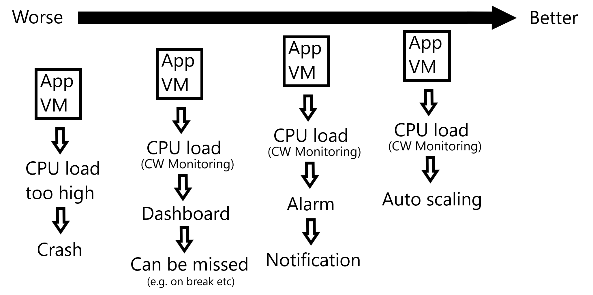

### Load testing with Apache Bench

Install ApacheBench:

> sudo apt-get install apache2-utils

Format for ab command:

> ab -n [number of requests] -c [concurrency] http://yourwebsite.com/

This command will show the response times for various requests and this can help determine if your page meets any requirement to speed you may have. 

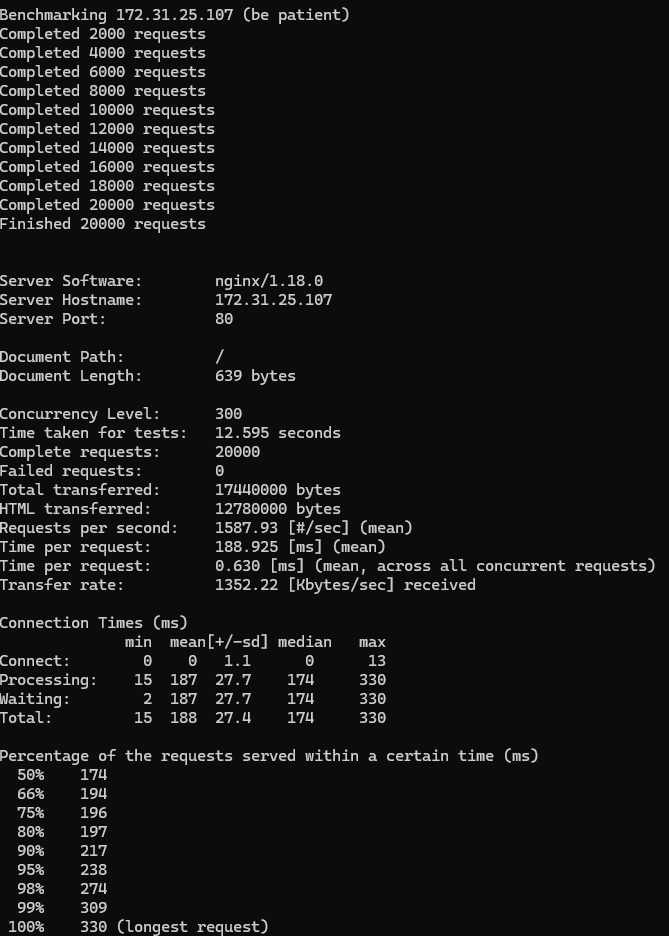

This shows the dashboard and the CPU ultilization section with spikes where the ab command has been used.

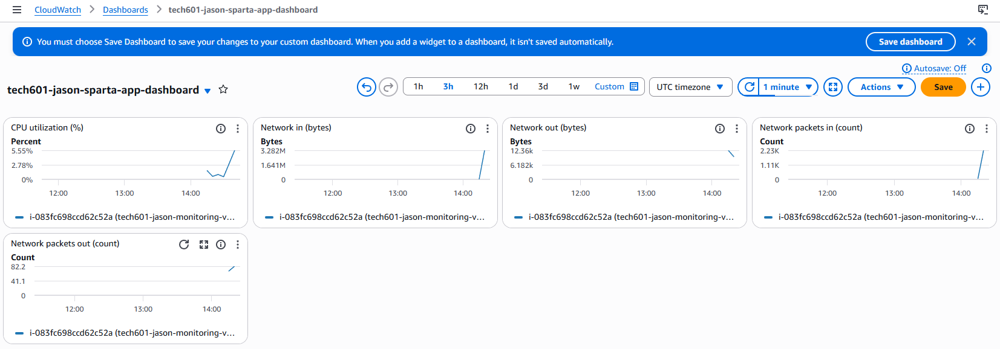

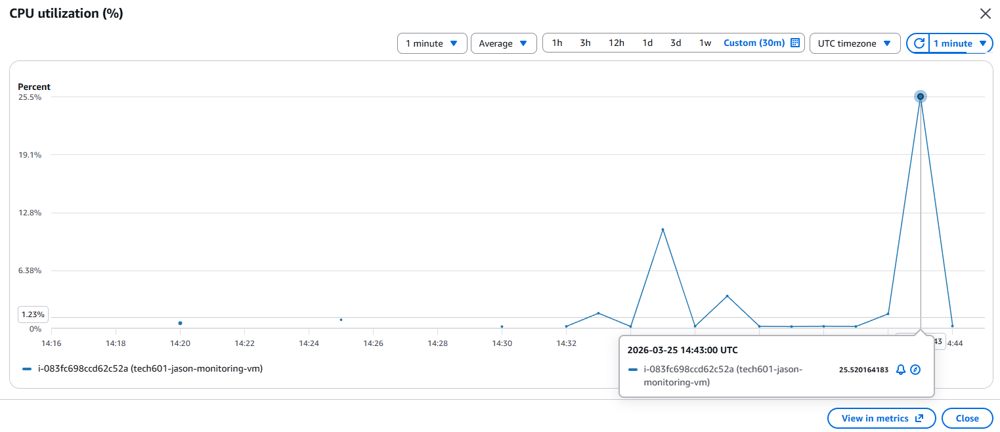

## Alarms

### Creating the alarm

To create an alarm a metric needs to be set, for this instance a `CPU_UTILIZATION` metric was used which could be found under EC2 metrics. Here the statistic (`Average`) and period (`1 minute`) are also set. 

Below that the conditions can be entered which determine how and when an alarm is triggered. For this example a percentage of `20` was selected with the condition being greater than this threshold. `Static` indicates that a value is used for the threshold. 

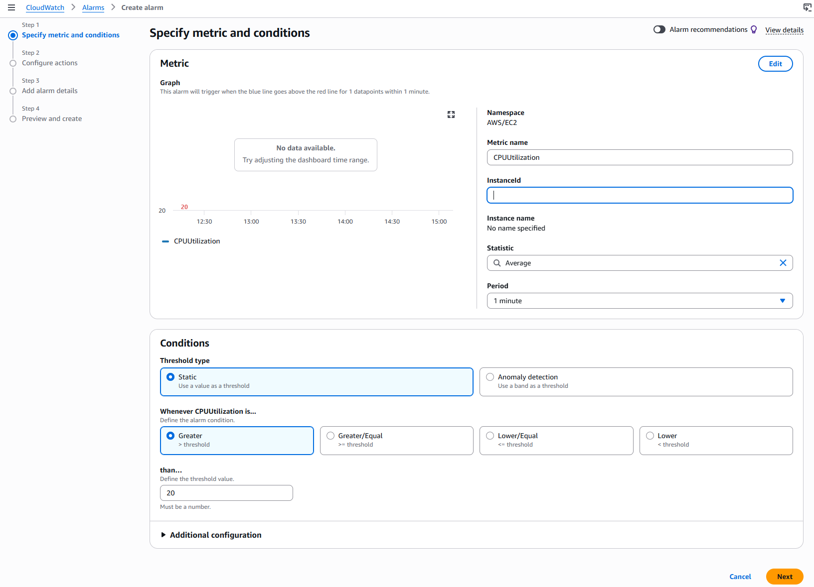

Once the conditions are in place the `SNS (Simple Notification Service) Topic` needs to be created, this simply requires a suitable name (`tech601-jason-alarm`) and the email for the notification to be sent to. Upon creation of this there will be a following subscription email with a link to confirm the subscription, without this being confirmed no notifications will come through.

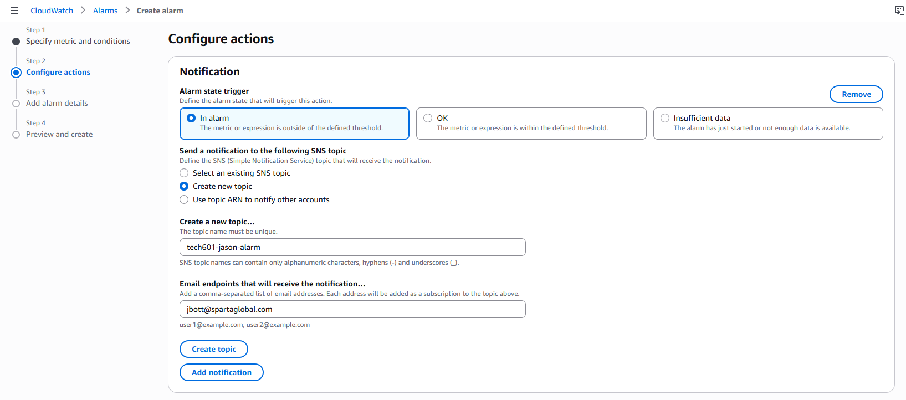

### Email Notifications

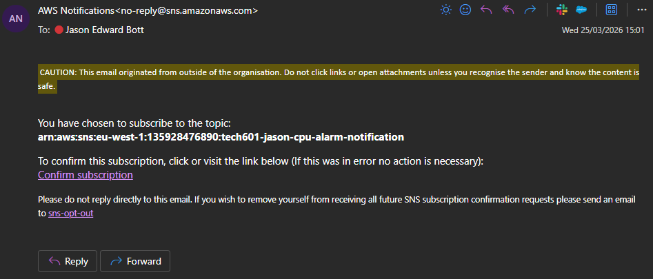

When the alarm is triggered an email notification is sent, this contains all the details including the alarm details, threshold, monitored metric, and state change actions.

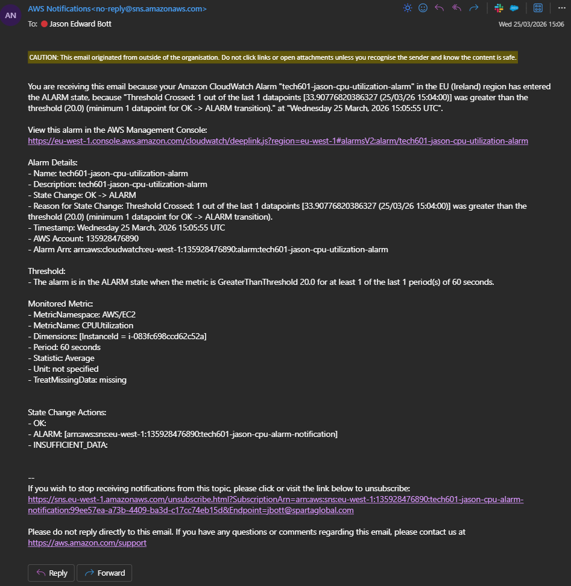

## Auto Scaling

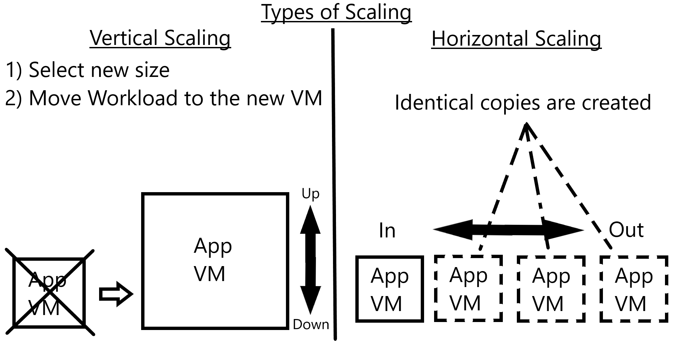

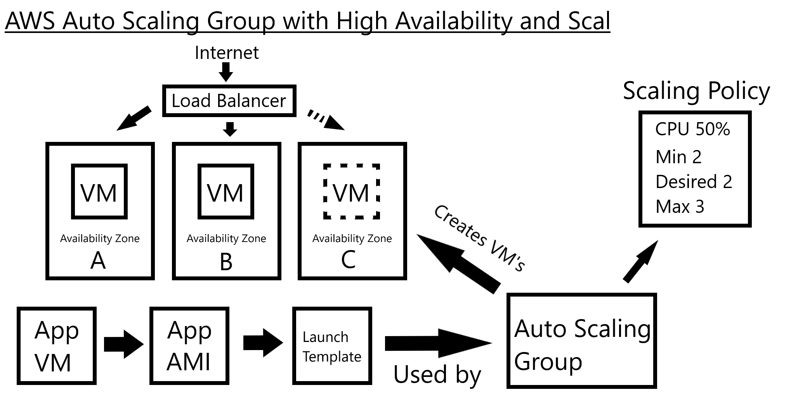

### Blockers

- Created load balancer internal facing instead of internet facing, this causes the link to not be accessable from the internet

### Auto Scaling Group Creation

- Name appropriately `tech601-jason-app-asg`
- Select launch template
  - Launch templates are created the same way as creating an instance from an image
- Select availability zones
  - More selected means more availability
- Select availability zone distribution

  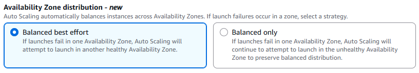

- Attach a new load balancer
  - Name = `tech601-jason-app-asg-lb`
  - Type = `Application` as this is HTTP
  - Scheme = `Internet-facing` to allow access from the internet
  - Under listeners and routing, create a new target group with the name `tech601-jason-app-asg-lb-tg`
- In health checks, enable `elastic load balancing`

  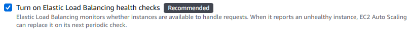

- Set health check grace period to an appropriate length
  - This should reflect how long your app takes to start up as we do not want to check before it is running.
  - e.g. if the app opens in 60 seconds, 90 seconds would be a safe grace period
- Group size is the number of instances you want running at once (`2`)
- Scaling states the minimum and maximum desired capacity (`Min = 2` `Max = 3`)
- Add a tag with the key `Name` to name new instances created by the Auto Scaling Group with the value entered.

### ASG, Target Group, Load Balancer, and URL

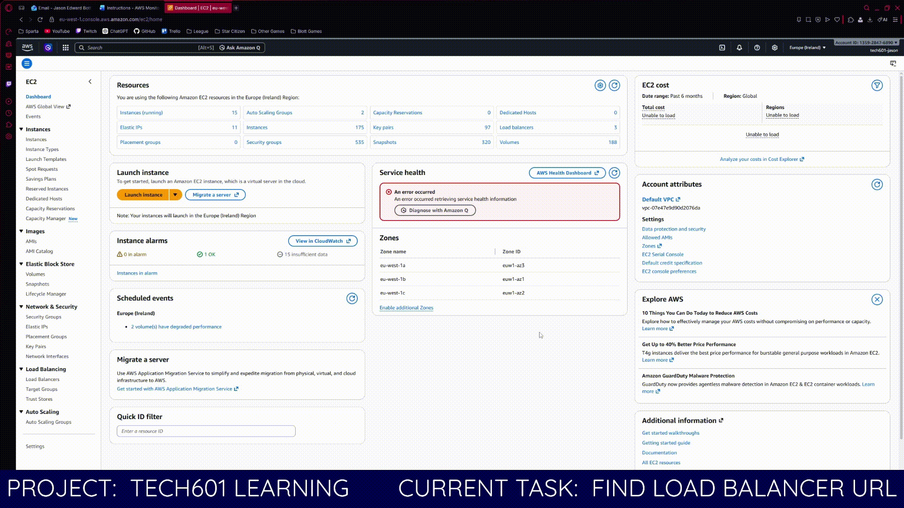

### Auto Scaling Group Deletion

1. Delete the load balancer
2. Delete the target group (if the load balancer is gone already it will say None associated in the Load balancer column)
3. Delete the ASG

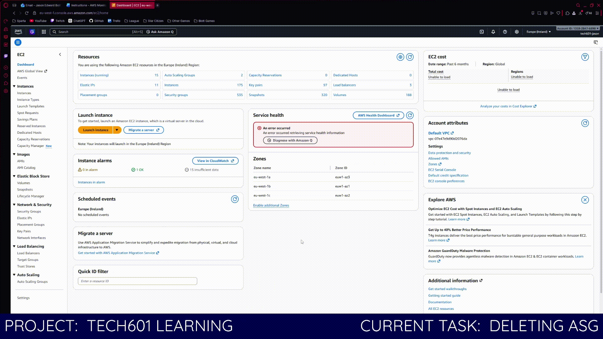