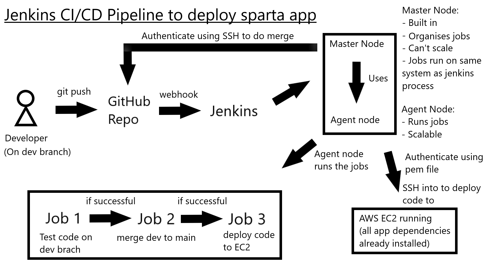
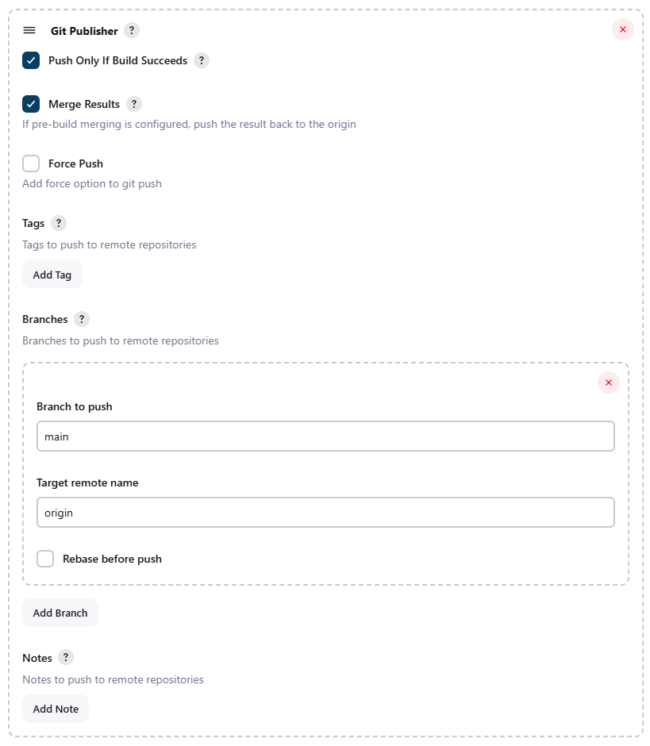
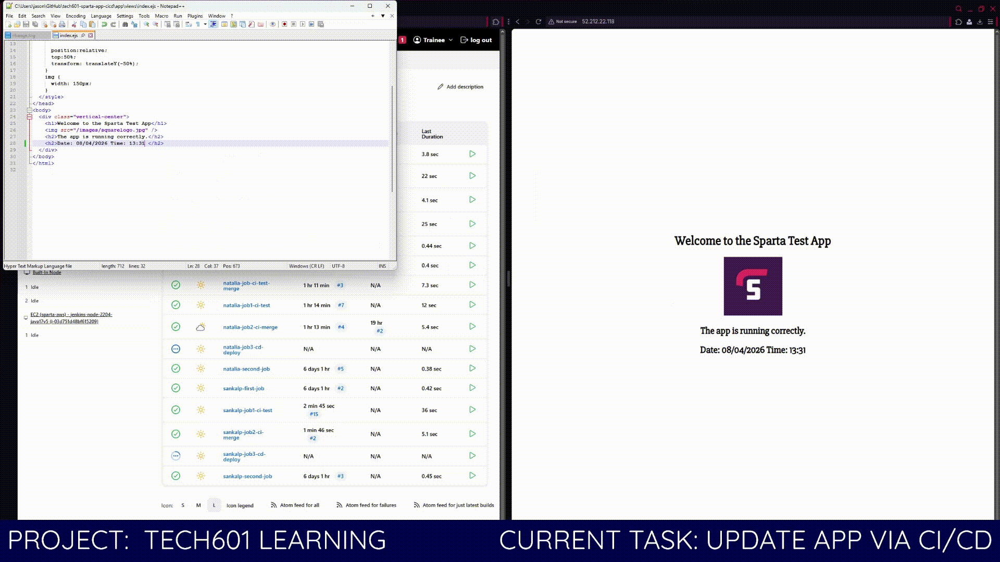

# CI/CD
#### Continuous Integration / Continuous Delivery or Deployment
---


- [CI/CD](#cicd)
      - [Continuous Integration / Continuous Delivery or Deployment](#continuous-integration--continuous-delivery-or-deployment)
  - [](#)


## CI

Continuous Integration is the practice of frequently merging code changes into a shared repository in which automated builds and tests are run.

This:
- Detects bugs early
- Reduces integration issues
- Improves code quality via automated testing
- Allows faster feedback for developers
- Enables fequent commits safely

## CD

CD extends CI by automating the release process.

There are two meanings:

1. Continuous Delivery
   - Code is always ready for release
   - Deployment requires manual approval

2. Continuous Deployment
   - Code is automatically deployed to production after passing tests

This:
- Creates faster releases
- Reduces manual effort
- Allows consistent deployments
- Reduces risk (small incremental changes)

### Differences

| Feature           | Continuous Delivery | Continuous Deployment      |
| ----------------- | ------------------- | -------------------------- |
| Deployment        | Manual trigger      | Fully automated            |
| Risk control      | Higher control      | Faster but riskier         |
| Use case          | Enterprises         | Startups / rapid iteration |
| Human involvement | Required            | Not required               |

## Jenkins

Jenkins is an open-source automation server used to build, test, and deploy applications. It helps implement CI/CD pipelines.

Benefits:
- Open-source and free
- Huge plugin ecosystem
- Supports CI/CD pipelines
- Easy integration with tools
- Extensible and customizable
- Strong community support

Drawbacks:
- UI is outdated
- Requires maintenance
- Can become complex at scale
- Manual setup compared to modern tools
- Performance issues if not optimized

### Stages of Jenkins

1. **Source** - Pull code from repository 
2. **Build** - Compile code
3. **Test** - Run automated tests
4. **Package** - Create artifact
5. **Deploy** - Deploy to environment
6. **Monitor** - Track performance

### What is an Artifact?

An artifact is a compiled or packaged output of your build. It is what gets deployed to environments.

Examples:
- `.jar` files (Java)
- `.exe` files
- ZIP packages

### Alternatives to Jenkins

- GitHub Actions
- GitLab CI/CD
- CircleCI
- Travis CI
- Azure DevOps Pipelines
- Bitbucket Pipelines
- TeamCity

### Why build a pipeline?

- Faster delivery of features
- Reduced human error
- Consistent deployments
- Improved product quality
- Better collaboration between teams
- Enables DevOps culture

## CICD Diagram




## SDLC

1. Plan – Requirements gathering
2. Design – Architecture & UI design
3. Develop – Coding
4. Test – QA validation
5. Deploy – Release to production
6. Maintain – Fix bugs, updates

CI/CD automates Develop -> Test -> Deploy

## Jenkins Setup

### Creating Job 1 (npm test, trigger from webhook)

1. Add name `jason-job1-ci-test` and select freestyle project
2. Select discard old builds, set # to `5`
3. Select GitHub project and add HTTPS URL, remove `.git` from the end and replace with `/`
4. Select Git
5. In Git add SSH URL
6. In Git add new credentials
   - Kind = `SSH Username with private key`
   - ID & Username = key name
   - Private Key = Enter directly and add from `cat private-key`
7. In Git set branch specifier to `*/dev`
8. In Build Triggers, select `GitHub hook trigger for GITScm polling`
9. In Build Environment, select `Provide Node & npm bin/ folder to PATH`, ensure node version is correct
10. Add an `execute shell` build step with:

```Bash
cd app
npm install
npm test
```

#### Creating GitHub webhook

- On the GitHub repo, go to settings -> webhooks
- Add URL for the jenkins server public ip with added `/github-webhooks/`

### Creating Job 2 (merge dev to main)

1. Add name `jason-job2-ci-merge` and select freestyle project
2. Select discard old builds, set # to `5`
3. Select GitHub project and add HTTPS URL, remove `.git` from the end and replace with `/`
4. Select Git
5. In Git add SSH URL and credentials
6. In Git set branch specifier to `*/main`
7. In Build Environment, select `SSH Agent`, ensure correct credentials are selected `jenkins to github key`
8. Add an `execute shell` build step with:

```Bash
git checkout main
git merge origin/dev
git push origin main
```

- Note that there is a `post-build action` with the plugin `Git Publisher` that can push the build for you after the job is completed, this would replace the line `git push origin main` in the `execute shell`
- This is the recommended option



1. In Job 1, under Post-build actions, select `build other projects` and add job 2 to `trigger only if build is stable`

### Creating Job 3 (deploy app)

1. Add name `jason-job3-cd-deploy` and select freestyle project
2. Select discard old builds, set # to `5`
3. Select GitHub project and add HTTPS URL, remove `.git` from the end and replace with `/`
4. Select Git
5. In Git add SSH URL and credentials
6. In Git set branch specifier to `*/main`
7. In Build Environment, select `SSH Agent`, ensure correct credentials are selected `ssh into ec2`
8. Add an `execute shell` build step with:

```Bash
scp -o StrictHostKeyChecking=no -r app ubuntu@108.130.111.154:/home/ubuntu/
ssh -o StrictHostKeyChecking=no ubuntu@108.130.111.154 << EOF
sudo rm -rf /tech601-sparta-app/app
sudo mv /home/ubuntu/app /tech601-sparta-app/
cd /tech601-sparta-app/app
npm install
pm2 delete sparta-app || true
pm2 start app.js --name sparta-app
EOF
```

- Note that `-o StrictHostKeyChecking=no` although it works, and bypasses the need for user input, this is not recommended in terms of security

9. In Job 2, under Post-build actions, select `build other projects` and add job 3 to `trigger only if build is stable`

### Jobs running

