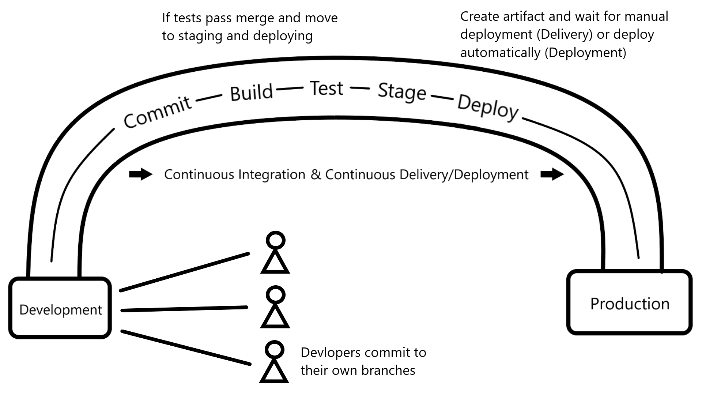

# CI/CD
#### Continuous Integration / Continuous Delivery or Deployment
---

- [CI/CD](#cicd)
      - [Continuous Integration / Continuous Delivery or Deployment](#continuous-integration--continuous-delivery-or-deployment)
  - 

## CI

Continuous Integration is the practice of frequently merging code changes into a shared repository in which automated builds and tests are run.

This:
- Detects bugs early
- Reduces integration issues
- Improves code quality via automated testing
- Allows faster feedback for developers
- Enables fequent commits safely

## CD

CD extends CI by automating the release process.

There are two meanings:

1. Continuous Delivery
   - Code is always ready for release
   - Deployment requires manual approval

2. Continuous Deployment
   - Code is automatically deployed to production after passing tests

This:
- Creates faster releases
- Reduces manual effort
- Allows consistent deployments
- Reduces risk (small incremental changes)

### Differences

| Feature           | Continuous Delivery | Continuous Deployment      |
| ----------------- | ------------------- | -------------------------- |
| Deployment        | Manual trigger      | Fully automated            |
| Risk control      | Higher control      | Faster but riskier         |
| Use case          | Enterprises         | Startups / rapid iteration |
| Human involvement | Required            | Not required               |

## Jenkins

Jenkins is an open-source automation server used to build, test, and deploy applications. It helps implement CI/CD pipelines.

Benefits:
- Open-source and free
- Huge plugin ecosystem
- Supports CI/CD pipelines
- Easy integration with tools
- Extensible and customizable
- Strong community support

Drawbacks:
- UI is outdated
- Requires maintenance
- Can become complex at scale
- Manual setup compared to modern tools
- Performance issues if not optimized

### Stages of Jenkins

1. **Source** - Pull code from repository 
2. **Build** - Compile code
3. **Test** - Run automated tests
4. **Package** - Create artifact
5. **Deploy** - Deploy to environment
6. **Monitor** - Track performance

### What is an Artifact?

An artifact is a compiled or packaged output of your build. It is what gets deployed to environments.

Examples:
- `.jar` files (Java)
- `.exe` files
- ZIP packages

### Alternatives to Jenkins

- GitHub Actions
- GitLab CI/CD
- CircleCI
- Travis CI
- Azure DevOps Pipelines
- Bitbucket Pipelines
- TeamCity

### Why build a pipeline?

- Faster delivery of features
- Reduced human error
- Consistent deployments
- Improved product quality
- Better collaboration between teams
- Enables DevOps culture

## CICD Diagram

## SDLC

1. Plan – Requirements gathering
2. Design – Architecture & UI design
3. Develop – Coding
4. Test – QA validation
5. Deploy – Release to production
6. Maintain – Fix bugs, updates

CI/CD automates Develop -> Test -> Deploy