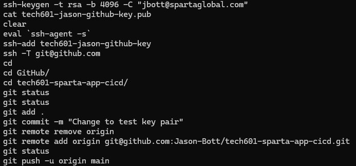

# Git & GitHub

## Commands

View branches:

> git branch

New branch:

> git branch dev

Switch branch:

> git switch dev

## What to do if something sensitive is accidently pushed

### Important Notes

- **Removing the file is not enough**, credentials need to be taken out of the Git history.
- `.gitignore` will **NOT** fix this, it only prevents future commits. It does **NOT** remove anything that has already been commited.

### Assume it is compromised

Anything like, API keys, passwords, tokens, credentials if pushed are now public and compromised.

### Delete/Change Credentials

Go to the service of the leaked credential and revoke the credential creating a new one in its place.

### Remove from the Git commit

```Bash
git reset --soft HEAD~1
git add .
git commit -m "Remove sensitive data"
git push --force
```

### Add it to .gitignore for the future

Add the file to the `.gitignore` to ensure it is not tracked in the future, and remember to remove it from the cache like so.

```Bash
git rm --cached secrets.txt
git commit -m "Remove secrets"
git push
```

## Pushing with SSH



1. Generate key pair:

> ssh-keygen -t rsa -b 4096 -C "jbott@spartaglobal.com"

2. Display public key for github (dont copy any white space at the end):

> cat tech601-jason-github-key.pub

3. On GitHub "settings" -> "deploy keys" -> "add key"
4. Enable use of ssh key:

> eval `ssh-agent -s`
> ssh-add tech601-jason-github-key

5. Test connection to GitHub:

> ssh -T git@github.com

6. Use ssh to push changes

Remove http origin:

> git remote remove origin

Add ssh origin:

> git remote add origin git@github.com:Jason-Bott/tech601-sparta-app-cicd.git

Push changes:

> git push -u origin main