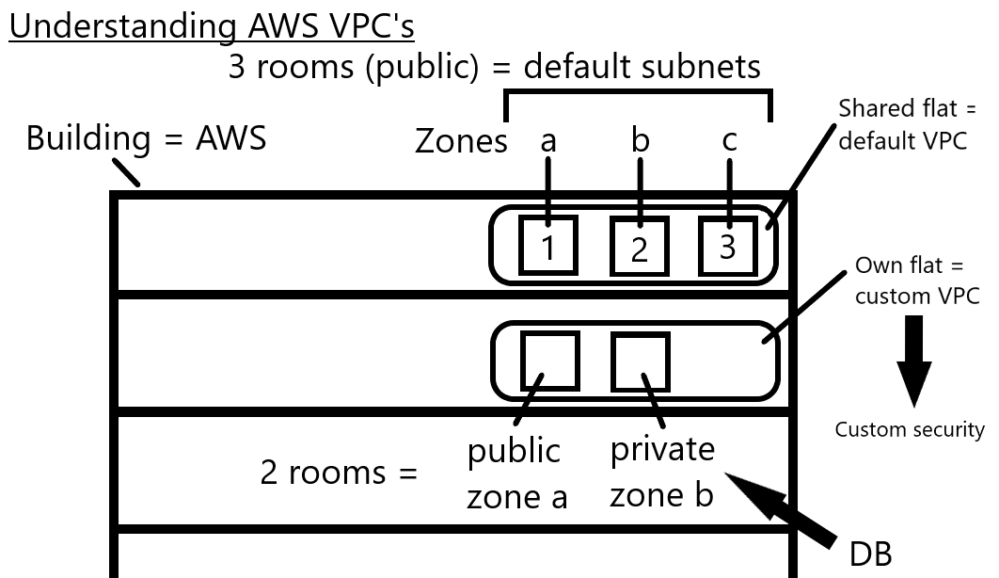
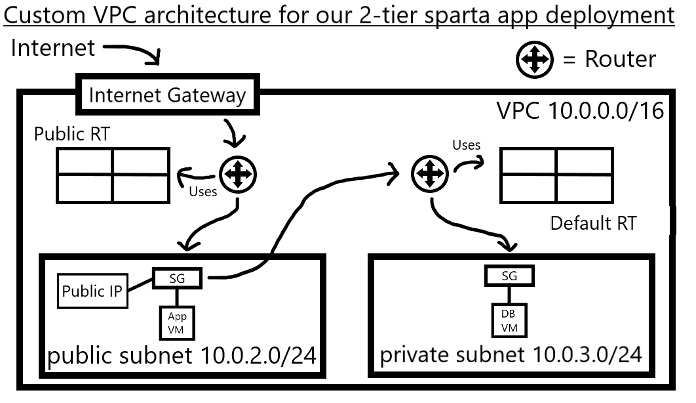
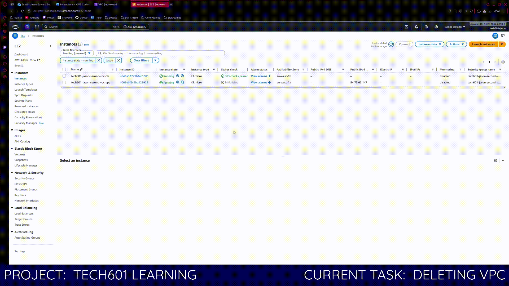

# VPC (Virtual Private Cloud)

- [VPC (Virtual Private Cloud)](#vpc-virtual-private-cloud)
  - [Understanding AWS VPC's](#understanding-aws-vpcs)
  - [VPC Architecture](#vpc-architecture)
  - [IPv4 and CIDR](#ipv4-and-cidr)
  - [Creating VPC](#creating-vpc)
  - [Deleting VPC](#deleting-vpc)

## Understanding AWS VPC's

- A VPC is your own private network inside AWS.
- Image AWS like a shared apartment building (public cloud):
  - The building = AWS infrastructure
  - Your apartment = your VPC
- Even though AWS is shared, a VPC gives you isolation and control over your resources.

- Region = a geographic aread (e.g. London, Ireland)
- Availability Zone = separate physical data centers within a region
  - Spread apart to reduce risk from failures/disasters
  - Typically 3 per region

- Subnet = a smaller network inside your VPC
  - They group resources
  - They apply security and access control
- Each subnet is linked to one availability zone
- You cannot span a subnet across multiple availability zones

- A custom VPC gives you full control over:
  - Network design
  - Security
  - Traffic flow
- Think of it as designing your own secure network layout, not just adding rules.

- Separate subnets for public and private services
  - Public = web servers
  - Private = databases
- This improves isolation and protection of sensitive resources

- Always plan architecture before building
- Decide on number of subnets, which AZ's to use, and how resources connect
- Planning avoids blockers, good planning = faster and cleaner setup

## VPC Architecture

- The VPC uses CIDR block 10.0.0.0/16
- Provides ~65,000 IP addresses
- Acts as the overall isolated network for the application
- Has both public (app) and private (db) subnet

- The internet gateway connects the VPC to the internet
- All incoming/outgoing traffic passes through here
- Works with route tables to control where traffic goes

- Public Route Table
  - Connected to the internet gateway
  - Allows traffic from the internet into the public subnet, and from the public subnet to the internet
- Default (Private) Route Table
  - Used by the private subnet
  - No direct route to the internet
  - Ensures the database is not publicly accessible

- Public subnet (10.0.2.0/24)
  - Contains the App VM
  - Has a public IP addres and a security group
  - Accessible from the internet
- Private subnet (10.0.3.0/24)
  - Contains the Database VM
  - Has a security group
  - No direct internet access
  - Only accessible from with the VPC (e.g. App VM)

- Database VM cannot run `apt update/upgrade` as there is not internet accesss
- Database must be created using a prebuilt AMI to work around this

## IPv4 and CIDR

- An IPv4 address looks like: 10.0.0.0
- It is made of 4 segments (octets) separated by dots
- Each segment contains 8 bits, with a range from 0 to 255, so 256 possible values
- The 8 bits are binary (00000000 or 11111111) hence 0 to 255

- Private IP address ranges are reserved for internal networks (like VPCs):
  - 10.0.0.0 - 10.255.255.255
  - 172.16.0.0 - 172.31.255.255
  - 192.168.0.0 - 192.168.255.255
- If an IP starts with `10.x.x.x`, `172.16-31.x.x`, or `192.168.x.x` it is usualy private
- Anything else is generally public

- CIDR = Classless Inter-Domain Routing
- Format = 10.0.0.0/16
- `/16` defines how much of the address is network portion vs host portion
- `/16` means the first 16 bits are fixed (network), remaining bits are for devices (hosts)
- 10.0.0.0/16 means there are 2^16 = 65,536 total addresses

- Subnetting means spliting the VPC CIDR into smaller ranges:
- VPC: 10.0.0.0/16
- Public Subnet: 10.0.2.0/24
- Private Subnet: 10.0.3.0/24
- `/24` means smaller range (~256 addresses per subnet)

## Creating VPC

1. Create VPC
    - IPv4 CIDR = `10.0.0.0/16`
2. Create Subnets
    - Public = `10.0.2.0/24`
    - Private = `10.0.3.0/24`
    - Select different availability zones for each
3. Create Internet Gateway
    - Then `Actions -> Attach VPC` to attach it to the VPC
4. Create Route Table
    1. Then edit subnet associations to make the public subnet explicit
    2. Then add route
        - Destination = `0.0.0.0/0`
        - Target = `Internet Gateway`
5. Creat DB Instance
    - Create from AMI
    - Create new security group and ensure it has the `VPC`
    - In new security group ensure `private subnet` is selected
    - When allowing mongodb port, limit traffic to `10.0.2.0/24` (the public subnet)
6. Create App Instance
    - Create from AMI
    - Create new security group and ensure it has the `VPC`
    - In new security group ensure `public subnet` is selected
    - When allowing ssh limit to `My IP` for more security
    - Set the private IP of the DB in the `DB_HOST` in the user data

## Deleting VPC

1. Delete Instances
2. Delete Security Groups
3. Delete VPC

