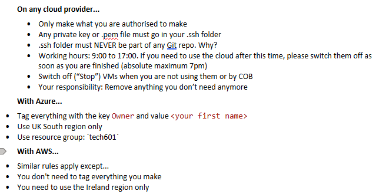
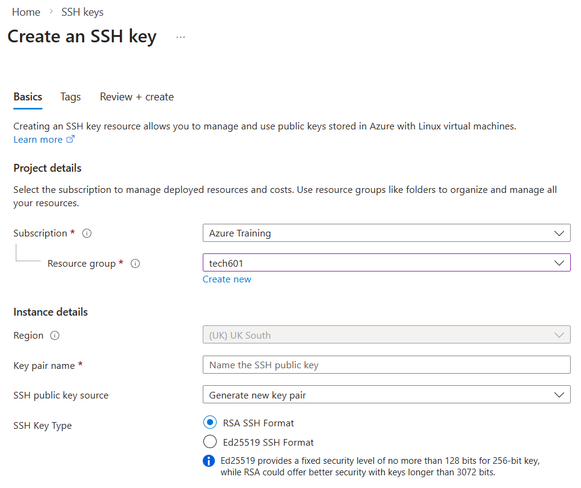
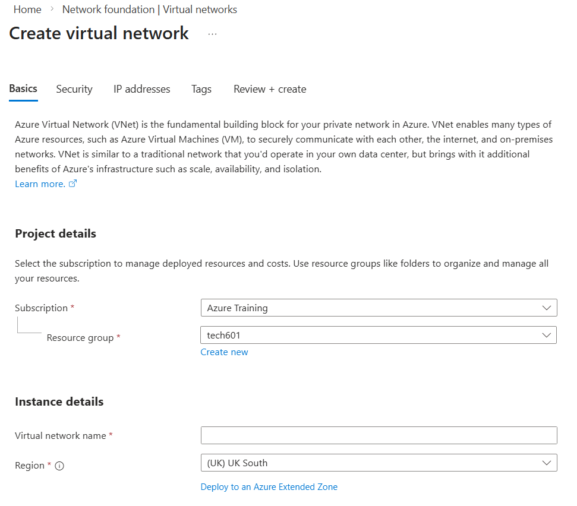
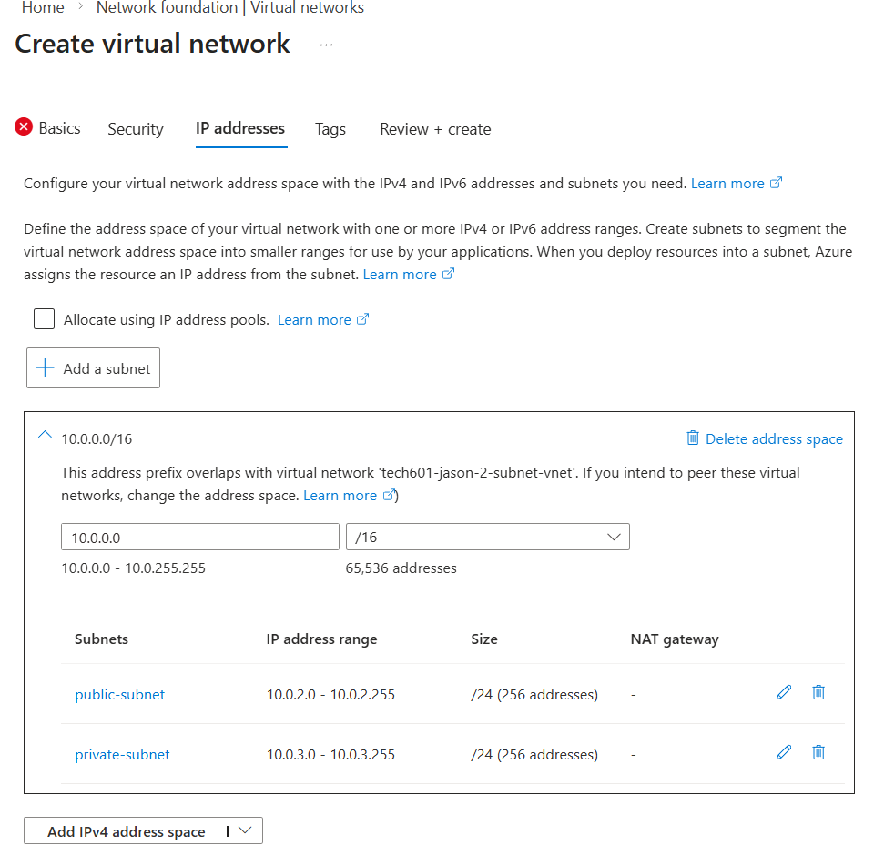
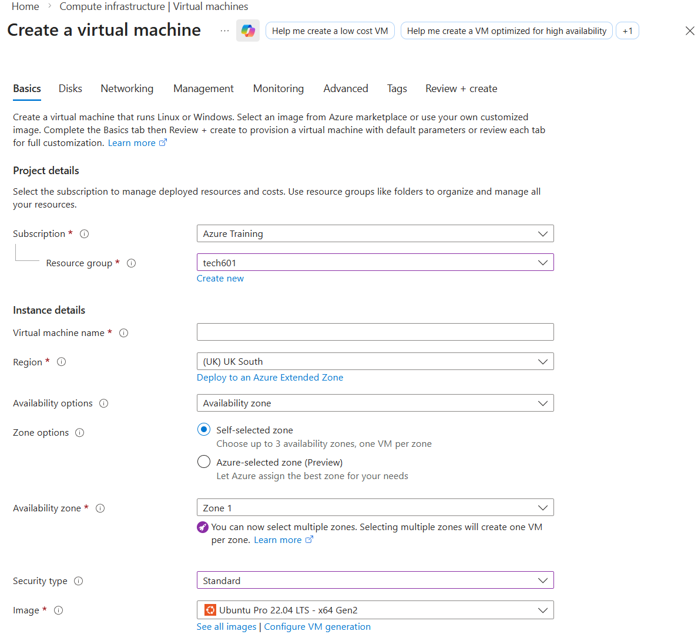
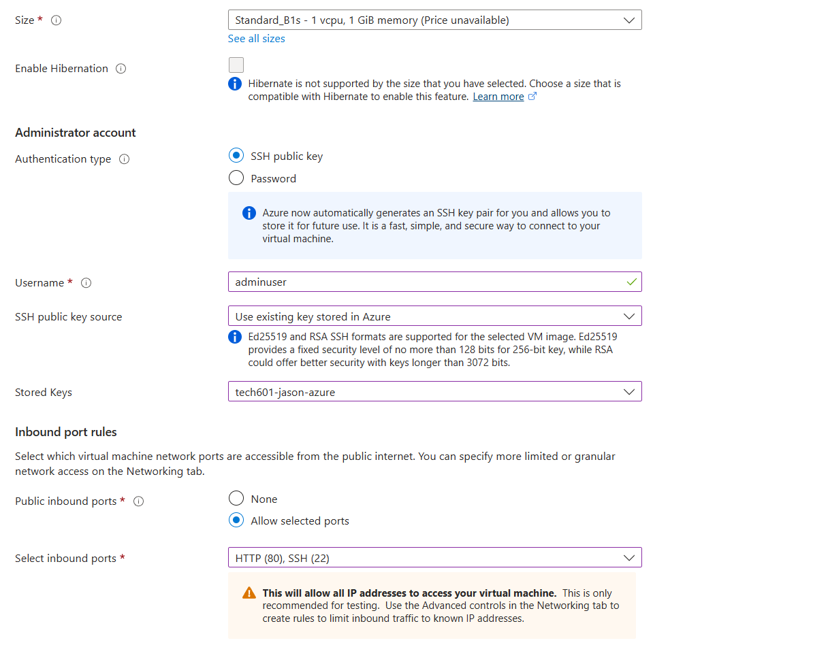
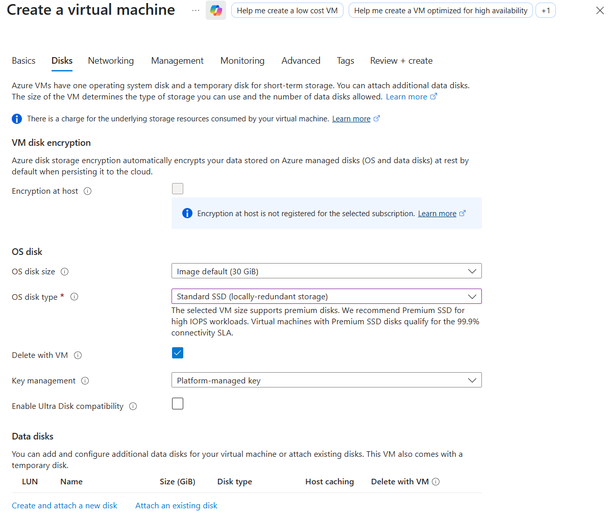
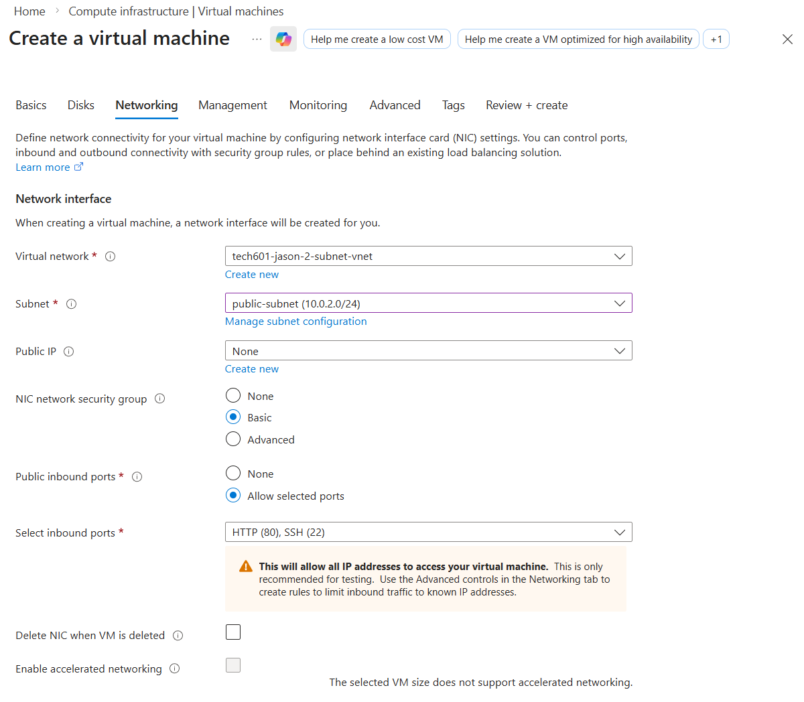

# Sparta App Deployment

## Stages of deployment

- Stage 1 = Manual
- Stage 2 = Bash Scripts
- Stage 3 = User Data
- Stage 4 = AMI's (Images)

## Reverse Proxy

### Manual 

1. Back up `/etc/nginx/sites-available/default` first
2. Nano into `/etc/nginx/sites-available/default`
3. Replace `try_files $uri $uri/ =404;` with `proxy_pass http://localhost:3000;`
4. Save file
5. Restart nginx with `sudo systemctl restart nginx`


### Automated

```Bash
sudo sed -i 's|try_files $uri $uri/ =404;|proxy_pass http://localhost:3000;|' /etc/nginx/sites-available/default

sudo systemctl restart nginx
```

## App Deployment (AWS)

### Stage 1

1. SSH into VM using `ssh -i "tech601-jason-aws.pem" ubuntu@ec2-108-131-7-73.eu-west-1.compute.amazonaws.com`
2. Update and upgrade using apt
   - `-y` will respond yes to any user inputs needed
3. Install necessary packages:
   - `Nginx` using apt
   - `node.js` using curl to download `nodesource_setup.sh` and apt
   - `pm2` using npm and `-g` for global install
4. Setup reverse proxy as shown previously
5. Clone git repo with spart app `git clone --recursive https://github.com/Jason-Bott/tech601-sparta-app.git`
6. `cd` into the app folder
7. `npm install`
8. Use `pm2` to start the app using `pm2 start app.js --name sparta-app`

### Stage 2

SSH into the VM.

Add all commands run in the order they were run to a bash script. 

Remember to add `DEBIAN_FRONTEND=noninteractive` to any commands that required a user input as this will prevent any console that requires user input from appearing.

It is also helpful to `echo` each line for debugging purposes.

See `prov-app.sh` for example Bash Script. 

### Stage 3

On creation of a VM instance, setup as previously setup, under advanced settings, find user data, import bash script used.

This runs the script once on creation of the virtual machine, and if everything is working the app will deploy without any need to SSH into the VM.

See `prov-app.sh` for example Bash Script to go into user data. 

### Stage 4

From a VM setup to be able to run the sparta app, go to the instances page and select create new image. Name accordingly and allow to generate.

This VM that the image is being created from should have the app in the root directory (not home) as the user data is run from there. If bash script in previous stage clones the repo in, then the app will already be in the root directory for that VM. All packages should also be pre installed.

Create a new instance from the created AMI, add a shortend Bash Script to the user data section containing code to cd into the repo and to start the app with pm2.

## Database Deployment with the App (AWS)

### Stage 1 

1. SSH and Upgrade as done with previous VM's
2. Install MongoDB
   - Follow official documentation to install ensuring versions are all correct
3. Change the `bindIp` of the file `/etc/mongod.conf` to `0.0.0.0` to allow connection from anywhere.
4. Start and enable mongod using systemctl
```Bash
sudo systemctl start mongod
sudo systemctl enable mongod
```
5. To allow the app to connect to the database, it must run the command `export DB_HOST=mongodb://<IP-ADDRESS>:27017/posts` with the databases private ip address (only works using private because the VM's are on the same VPC).

### Stage 2

SSH into VM, automate using commands in a Bash Script, remembering debugging practices and ensuring no user inputs will be required.

Example script found in `prov-db.sh`

### Stage 3

Import the Bash Scripts into the respective VM's for the database and app. If database is created first then the app VM shouldn't try accessing the database before it is set up.

### Stage 4

Create images from the respective VM's and create run only scripts for both the app and database to go into their user data sections. This should speed up the process as neither need to install anything anymore.

Just remember to change the `IP Address` in the app script.

## App Deployment (Azure)

### Notes



### Mistakes

- When creating in Azure use the search bar at the top to find what you want to create (i.e. ssh key, vnet, vm)
  - **DO NOT** use the create button, this causes region errors

### Process

#### SSH

Ensure resource group is selected, this should automatically select the correct region, if not find another way to enter the creation screen.

Add an appropriate name (tech601-jason-azure) and create. Don't forget to add tags.



#### VNet

Select the resource group and add an appropriate name (tech601-jason-2-subnet-vnet).



Add a public (10.0.2.0/24) and private (10.0.3.0/24) subnet and ensure address range is 10.0.0.0/16.




#### VM

Select resource group, add appropriate name (tech601-jason-app-vm), set security type to `standard`, and image to `Ubuntu Pro 22.04 LTS - x64 Gen2`.



Set the size to `Standard_B1s`, set username to `adminuser`, select your ssh key pair, and allow SSH and HTTP ports.



Change disk type from `premium ssd` to `standard ssd` to reduce unnecessary costs.



Select your vnet and the appropriate subnet (public for app, private for db), create a public ip if necessary.



From this point the VM's can be run simillarly to AWS either manually using commands, adding bash scripts, using user data, or using an image.

One small difference to note, because of the use of subnets, the db connection string should contain the private subnet address (e.g. 10.0.3.4).